#  Exploramus

**Exploramus** is a discovery-focused application built with **Kotlin Multiplatform (KMP)**. It allows users to explore data, search for information, and manage personal favorites using a shared codebase for core logic and state management.

## Architecture & Key Features

### DKMP Architecture
The project is built using the **[D-KMP architecture](https://github.com/dbaroncelli/D-KMP-sample)**, a powerful pattern for Kotlin Multiplatform that enables 100% shared business logic and state management.

*   **Shared ViewModel**: A centralized `DKMPViewModel` acts as the single entry point for the UI, handling state for both Android and iOS.
*   **Reactive State Management**: Uses immutable state flows (MVI pattern) to ensure predictable and consistent UI updates across platforms.
*   **Total Platform Independence**: Core logic—including navigation, data orchestration, and state—is isolated from the UI, allowing for native-quality views with zero logic duplication.

### Core Capabilities
*   **Declarative & Adaptive UI**: Uses **Jetpack Compose** (Android) and **SwiftUI** (iOS) to build native-quality, form-factor aware layouts for phones, tablets, and foldables.
*   **Native Dark Mode**: Full support for system-wide light and dark themes across both platforms.
*   **Offline-First Resilience**: Data is persisted locally using **SQLDelight**, ensuring functionality without an active network connection.
*   **Data Orchestration**: Unified repository pattern that seamlessly manages data from Remote APIs (**Ktor**), Local Databases, and Static Assets.
*   **Comprehensive Testing**:
    *   **Unit Tests**: Coverage for shared ViewModels, repositories, and business logic.
    *   **UI Tests**: Native automation for both platforms (Compose UI Tests & XCTest).

## Modular Structure

The project is architected into clean, decoupled modules to maximize maintainability:

- **`:shared`**: The core "brain" of the application. It houses the `DKMPViewModel`, global state management, and the shared navigation routing engine.
- **`:data`**: A structured data layer divided into specialized sub-modules:
    - **`:data:repository`**: The coordinator that implements the repository pattern, managing data flow between local and remote sources.
    - **`:data:network`**: API clients and data transfer objects, powered by **Ktor**.
    - **`:data:localdb`**: Local persistence layer utilizing **SQLDelight** for type-safe database operations.
    - **`:data:assets`**: Specialized handling for bundled static data and application assets.
- **`:core`**: Contains pure Kotlin models, domain entities, and common utilities used throughout the entire project.
- **`:di`**: Global dependency injection powered by **Koin**.

## Visual Showcase

### Android Experience
| Home (Light) | Home (Dark) | Section | Details | Search | Settings |
|:---:|:---:|:---:|:---:|:---:|:---:|
| 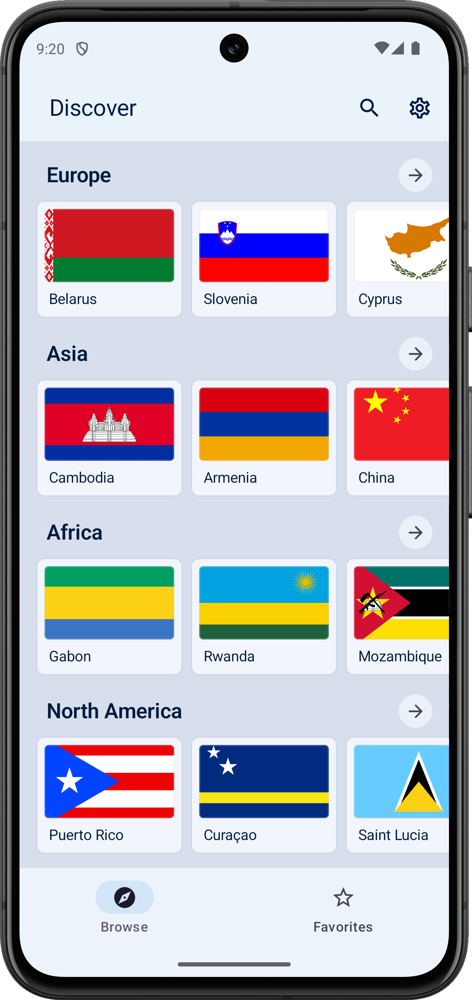 | 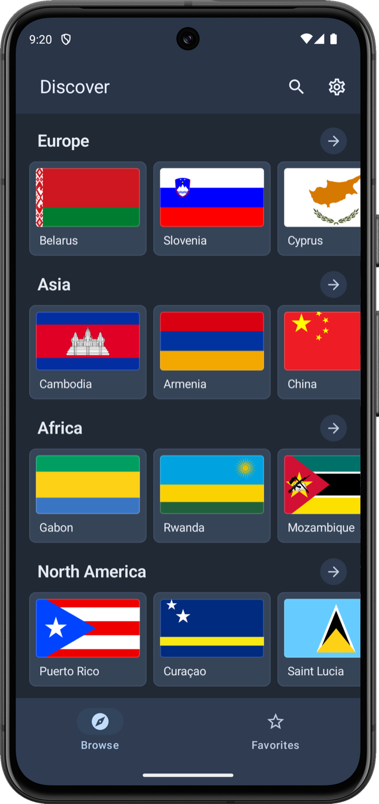 | 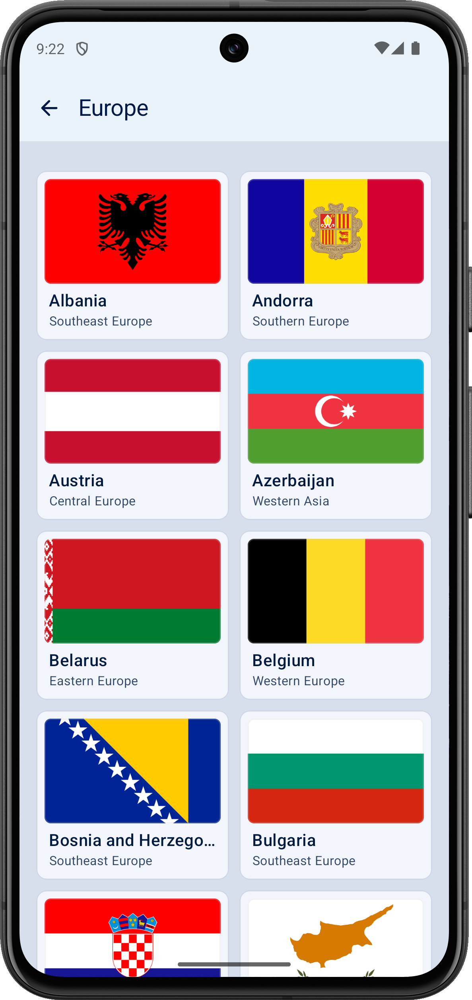 | 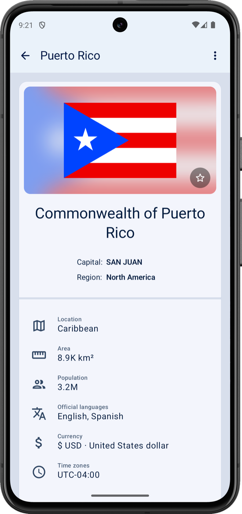 | 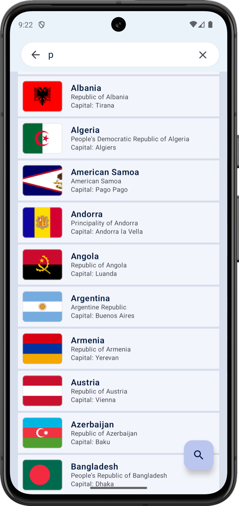 | 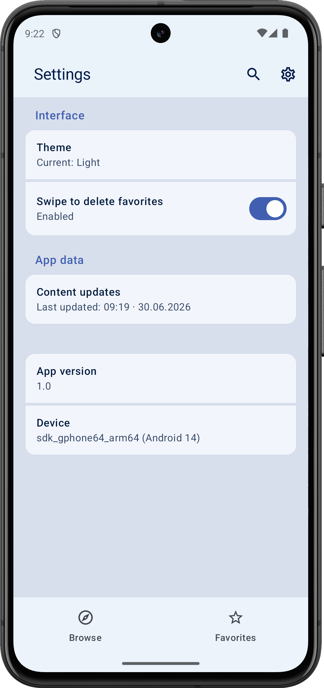 |

### iOS Experience
| Home (Light) | Home (Dark) | Section | Details | Search | Settings |
|:---:|:---:|:---:|:---:|:---:|:---:|
| 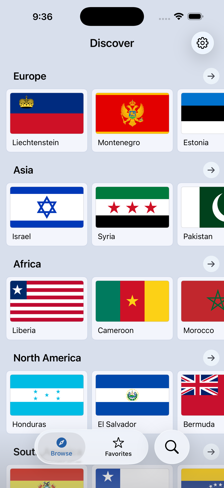 | 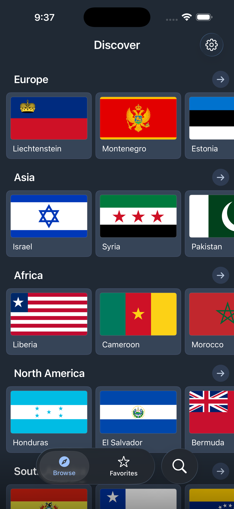 | 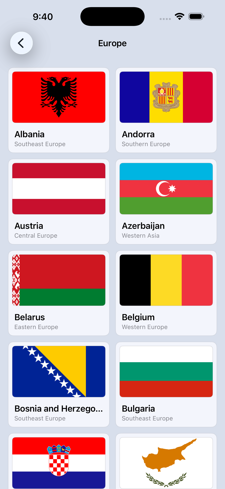 | 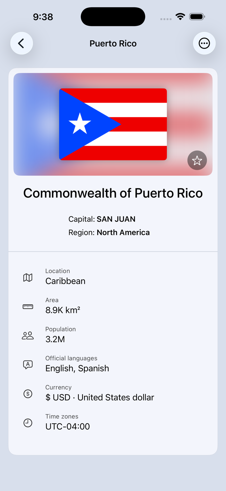 | 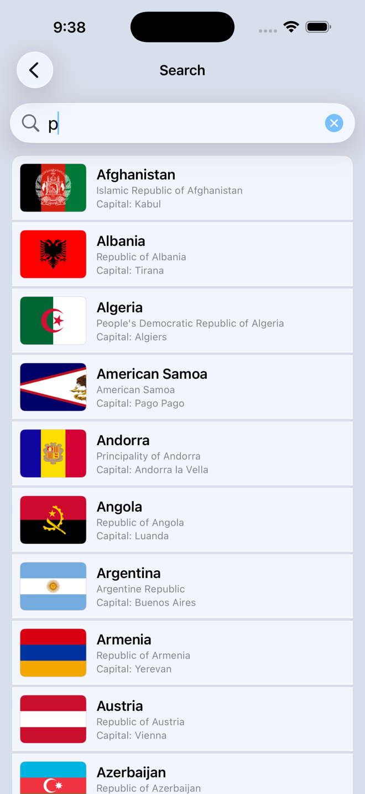 | 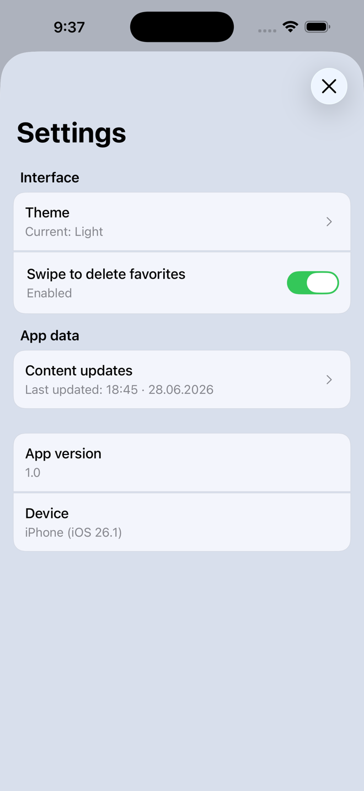 |

### Tablet Support
| Android Tablet | iPad |
|:---:|:---:|
| 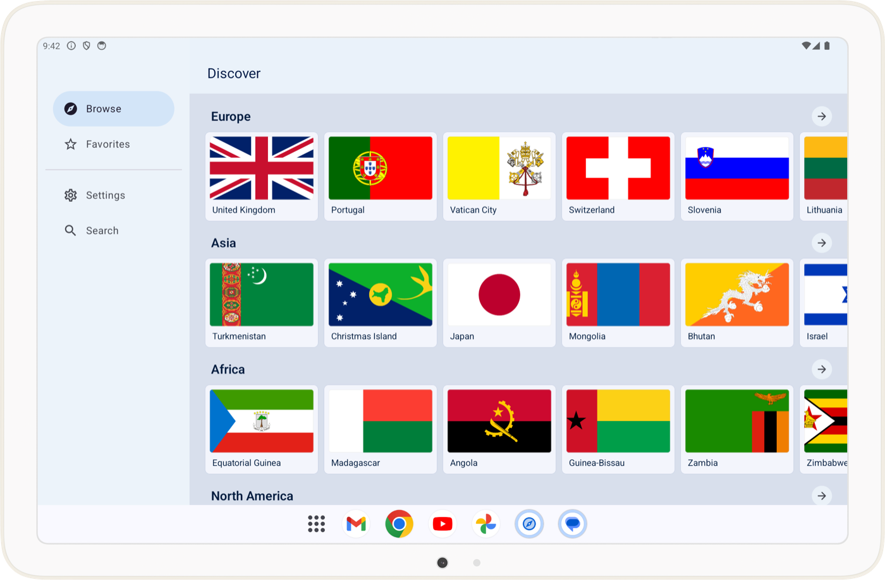 | 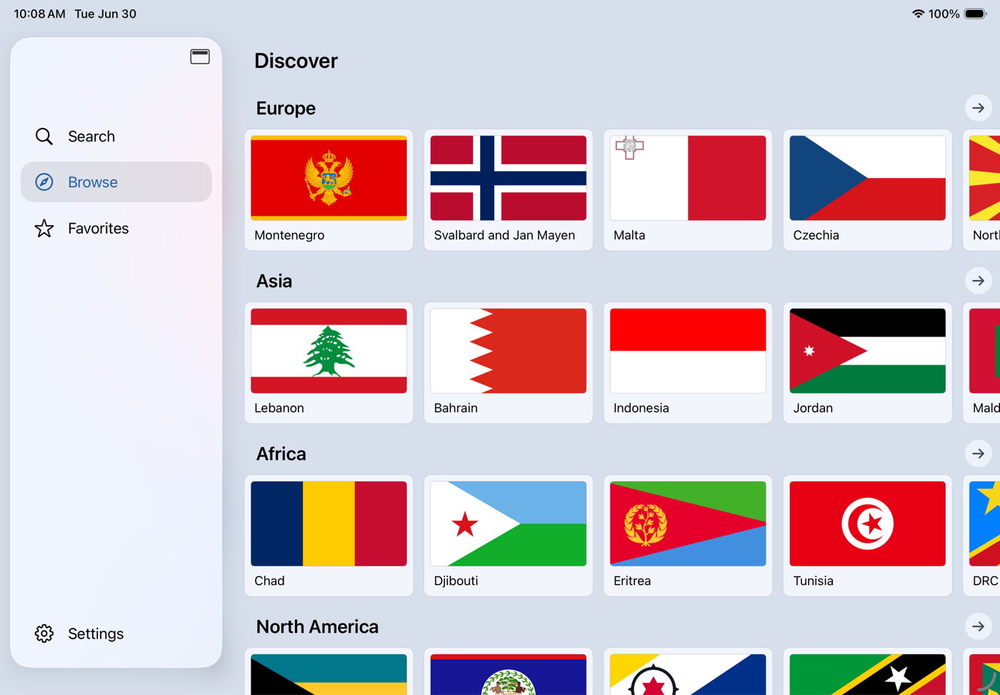 |

## Tech Stack & Adaptive UI

### Core Technologies
- **Networking**: [Ktor](https://ktor.io/) | **Database**: [SQLDelight](https://cashapp.github.io/sqldelight/) | **DI**: [Koin](https://insert-koin.io/)
- **Concurrency**: Coroutines & Flow | **Swift Interop**: [SKIE](https://skie.touchlab.co/) | **Images**: [Coil](https://coil-kt.github.io/coil/)

### Adaptive UI
Exploramus is fully form-factor aware:
- **Android**: Uses `Material3 Adaptive` components and custom `AdoptiveValue` utilities for Compact, Medium, and Expanded sizes.
- **iOS**: Custom adaptive logic in SwiftUI for tailored iPhone and iPad experiences.

---

Learn more about [Kotlin Multiplatform](https://www.jetbrains.com/help/kotlin-multiplatform-dev/get-started.html).
